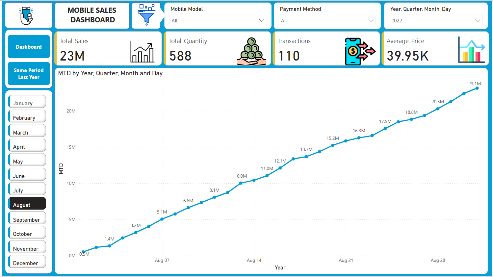

📊 # Mobile Sales Dashboard

📝 Overview
The Mobile Sales Dashboard is an interactive Power BI dashboard designed to analyze mobile sales performance over different periods. It provides key business insights by visualizing sales, transactions, quantities sold, average price trends, and payment methods. The dashboard enables users to track performance across months, quarters, and years while also allowing comparisons with the same period last year (SPLY) and month-to-date (MTD) trends.

For data extraction and Power BI for visualization, the dashboard helps businesses optimize their strategies, improve decision-making, and identify key revenue drivers.

📷 Dashboard Visuals

### Mobile Sales Dashboard

### Same Period Last Year Analysis

### Month-to-Date (MTD) Report

Key Features & Insights
📌 1. Sales Overview
Total Sales: Displays overall revenue generated in the selected period.

Total Quantity Sold: Tracks the number of mobile units sold.

Transactions: Counts the total number of sales transactions.

Average Selling Price (ASP): Determines the average price per unit sold.

📊 2. Sales Trends & Performance Analysis
Total Sales by Month: A line chart visualizing the trend of mobile sales across months.

Sales Performance by Quarter: Helps businesses compare quarterly performance.

Sales Comparison (Same Period Last Year - SPLY): Compares the current period’s sales with the previous year to identify growth or decline.

Month-to-Date (MTD) Analysis: Shows cumulative sales trends for the current month, tracking daily progress.

🌍 3. Geographical Insights
Total Sales by City: An interactive map displays sales distribution across various cities.

Regional Performance Tracking: Helps businesses focus on high-performing regions and adjust marketing strategies.

📱 4. Mobile Model & Brand Performance
Total Sales by Brand: Compares the performance of brands like Apple, Samsung, OnePlus, and Vivo.

Total Sales by Mobile Model: Highlights the top-selling mobile models, such as iPhone SE, OnePlus Nord, and Galaxy Note 20.

💳 5. Payment Method Analysis
Breakdown by Payment Mode: Tracks transactions based on UPI, Debit Cards, Credit Cards, and Cash.

Customer Preference Trends: Helps businesses optimize payment options based on user preferences.

📅 6. Sales Distribution by Day
Sales Performance by Day of the Week: Identifies peak sales days to strategize marketing campaigns.

🚀 Benefits of Using This Dashboard
✅ Improved Decision-Making: Provides data-driven insights for better business strategies.
✅ Performance Tracking: Helps in monitoring revenue trends and growth opportunities.
✅ Sales Optimization: Identifies top-performing regions, brands, and models.
✅ Customer Insights: Understands buying behavior through payment method analysis.
✅ Historical Comparisons: Tracks progress compared to past sales data.
